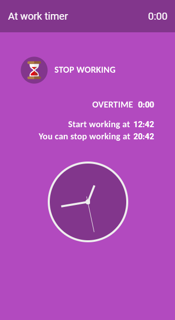

# Worktime Web Application

To monitor time spend on work. Just a **start** and **stop** button to track **8 hours** of working time.  
Midnight 0h00 will close the day and calculate overtime for the 8 hour workday.
Weekends are treated differently, using a 0 hour workday (alsways overtime).

Overtime can be corrected by clicking on overtime. In case you forgot to start or stop the timer.

The display presents the following information;

* How much time you spend on work today, top right.
* Overtime (or undertime), cummulated over previous workdays.
* Start working at time.
* A message at what time you can stop working.

## Technical aspects

* There's a timer which updates the information on display every minute.
* Information is stored in local-storage. Which is deleted when you instruct your browser to clear, reset data (cookies).
* Using MicroSoft TypeScript and VSC-editor (config files).

### Nice features to have

* Mark a day as a holiday (stops the timer on a workday, active as if it was a weekend).
* Create projects, to manage time spend on projects.
* Store data on a server (it's now local storage wich can de deleted).
* Activation and using service workers (store data on server).
* A notification is pushed, when 8 hours worktime is reached.

## Problems detected

This Web App is more or less a journey into learning Web Applications, TypeScript and Google Polymer. Goal is to make a Fully Progressive Web Application. But some functionallity I need to explore, to do are;

* Working off-line, no internet connection. Now it freezes, when no internet is available. Why, I don't know.
* Push notifications, it seems to work on deveopment PC, but not on mobile phone.
* Service Worker for off-line working.
* The analog clock does not display correct time, when the App awakes from inactive mode.
